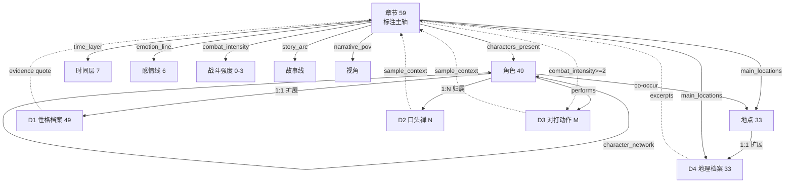

# 《苇舟江湖梦》量化扩展 · 拓扑图谱与关联结构

> 阶段一产出（深度思考 / 大规模拓扑扩展）。在既有 59 章受控词表标注体系之上，系统扩展四类可量化维度：
> **角色性格特征、口头禅（标志语）、精彩对打动作、地点地理描述**。
> 本文档定义每类维度的实体层级、受控词表 / 分类法、抽取方法论、输出 schema，以及与既有实体的关联边，
> 作为后续「逐项落实量化实现」与「完整审查」的蓝图。

---

## 0. 设计原则（从 darwin-skill 借来的纪律）

用户点名的 darwin-skill 本质是 *SKILL.md 优化器*，与小说量化无直接关系；但其方法论可移植到本项目的**审查阶段**：

1. **基线 → 改进 → 实测验证 → 人类确认 → 只保留有改进者（ratchet）**：新增模块不得破坏既有 17 份报告的任何计数与链接。
2. **结构化评分 + 独立核验**：Phase 3 审查按 准确性 / 一致性 / 覆盖完整性 三轴打分，证据必须可抽样回原文。
3. **人在回路的检查点**：维度方法学的「自动词表抽取 vs 人工受控标注」分叉，必须在实现前确认。

---

## 1. 既有实体图谱（扩展底座）

| 实体 | 规模 | 载体 | 关键字段 |
|---|---|---|---|
| 章节 Chapter | 59 | `chapter_data/all_tags.json`（list[59]） | `time_layer / main_locations / characters_present / chapter_type / story_arc / emotion_line / combat_intensity / narrative_pov / key_events / tags_free` |
| 角色 Character | 49 | `char_stats.json` | 名 / 出场章数 / mentions / 首次末次章 |
| 地点 Location | 33（实际落文 22） | `spatial_data.json` + `text_coords.json` + `geo_features.json` | 节点坐标 / 相对方位 / 地理要素（山·河·湖·道） |
| 时间层 TimeLayer | 7 | all_tags.time_layer | 初入江湖 → 大战/决战 |
| 感情线 Emotion | 6 | all_tags.emotion_line | 平淡/升温/无/虐/波折/分离 |
| 战斗强度 Combat | 0–3 | all_tags.combat_intensity | 全本分布 14/13/21/11 |
| 角色关系 Network | 101 节点 / 1318 边 | `analysis/character_network.json` | 关系强度 |

> **关键约束**：新维度产出的角色名必须 **逐字等于** `char_stats.json` 的姓名；地点名必须 **逐字等于** `spatial_data.json` 节点名。这是 Phase 3「一致性」的第一条硬指标。

---

## 2. 新增维度体系（拓扑节点）

### D1 · 角色性格特征（Character Personality Profile）
- **层级**：character（扩展 `char_stats.json`，1 角色 → 1 性格档案）
- **分类法（性格维度轴）**：武侠语境定制 6 轴，每轴两极为受控标签，配词表：

| 轴 | 极 A（词表示例） | 极 B（词表示例） |
|---|---|---|
| 性情 temperament | 冷静·沉稳·淡然·从容·镇定 | 急躁·暴烈·焦躁·火冒·浮躁 |
| 品性 morality | 仁厚·悲悯·侠义·宽厚·方正 | 狠辣·阴毒·残忍·冷酷·刻薄 |
| 心气 pride | 谦和·低调·内敛·温润 | 孤傲·睥睨·清高·张扬·狂妄 |
| 情义 loyalty | 重情·义气·护短·舍身·忠勇 | 薄情·背叛·翻脸·冷血·背信 |
| 智愚 wisdom | 机变·算无遗策·通透·沉吟·审时 | 鲁莽·莽撞·执拗·不计后果·昏聩 |
| 胆气 courage | 无畏·悍然·赴死·不退·凛然 | 畏缩·惊惧·怯懦·颤栗·退缩 |

- **输出 schema（char_traits 段）**：
  ```
  trait_axes: { temperament:"沉稳", morality:"侠义", pride:"谦和", loyalty:"重情", wisdom:"机变", courage:"无畏" }
  trait_signals: [ { axis, pole, score, evidence:[ {chapter, quote} ] } ]   // 可人审
  dominant_traits: [ "侠义", "沉稳", "机变" ]
  ```
- **抽取方法**：对每个角色，取其所有出场章的「姓名语境窗口」（含该名的前后 N 句），用词表命中计数 → 每轴取高分极 → 落 evidence（原文 quote + 章号）。属**自动词表抽取 + 可人审证据**，精度靠 Phase 3 抽样。

### D2 · 口头禅 / 标志语（Catchphrase / Signature Utterance）
- **层级**：phrase（归属角色，1 角色 → N 标志语）
- **抽取方法**：
  1. 对话归属正则：`(角色名)(说|道|喝道|冷笑|沉声|低语|喃喃|大笑|喝)\s*[：:「“](.+?)[”」]` → 抓引号内 utterance。
  2. 归一（去空白、去句末标点）；按**最近前置角色名**归并到角色。
  3. 复现识别：对归并后的 utterance 做 2–6 字 n-gram 频率，阈值 `min_freq≥3` 且集中于同一角色 → 判为口头禅；同时保留「整句级」高频原话。
- **输出 schema**：
  ```
  catchphrases: [ { phrase, character, freq, chapters:[...], first_chapter, sample_context } ]
  ```
- **注意**：单字角色名（如「影」「空」）的对话归属需用否定清单排除光影泛指（沿用 `_rebuild_char_mentions.py` 机制），避免错归。

### D3 · 精彩对打动作（Combat Action Vocabulary）
- **层级**：action（聚合到 章 + 角色），依托既有 `combat_intensity≥2` 的战斗章
- **分类法（动作词表）**：

| 类 | 词表示例 |
|---|---|
| 兵器 weapon | 劈·砍·斩·刺·挑·撩·格·挡·架·削·点·崩·截·缠·封 |
| 身法 movement | 纵·跃·闪·避·旋·翻·掠·腾·窜·疾走·落 |
| 内力 internal | 运功·吐纳·内力·真气·罡气·气劲·震·涌·灌·爆 |
| 招式 technique | 剑气·掌风·拳影·腿影·指风·刀芒·剑芒·残影·虚影 |
| 防守 defense | 卸·化·引·借力·闪避·格挡·封挡·腾挪 |
| 伤效 outcome | 血溅·断臂·洞穿·震退·击飞·封喉·贯胸·吐血 |

- **输出 schema**：
  ```
  combat_actions: { vocab:[ {action, category, freq, chapters:[...], characters:[...], sample_context} ],
                    by_chapter:{ chN:[action,...] },
                    sequences:[ {bigram:"劈→格", freq}, ... ] }   // 招式组合 n-gram
  ```
- **抽取方法**：仅在战斗章（combat_intensity≥2）扫描；动作词命中后，取其上下文窗口内最近角色名 → 归属；相邻动作按章内出现序做 bigram 序列。

### D4 · 地点地理描述（Location Geography Profile）
- **层级**：location（扩展 `spatial_data.json` / 聚合 `geo_features.json` + `text_coords.json`）
- **抽取方法**：
  1. 直接复用 `geo_features.json` 既有 17 项要素（山地5·河流5·湖泊2·道路5）的 `type/attr`。
  2. 对每个地点名，抓其语境窗口中含**地形/气候/地标**关键词句（`山·峰·江·河·湖·渡·郡·城·关·崖·谷·林·原·风寒·湿润·险峻·开阔·幽静·巍峨`…）→ 抽描述句。
  3. 地形归类（山岳型 / 水滨型 / 城郭型 / 关隘型 / 平原型）。
- **输出 schema**：
  ```
  geo_profile: { location, terrain_type, features:[...], climate_hints:[...], landmarks:[...], relative_pos, excerpts:[ {chapter, text} ] }
  ```

### D5 · 候选扩展（「等维度」，待确认是否纳入）
- **兵器 / 功法**（从 D3 招式类 + `tags_free` 提炼）
- **情感表达模式**（emotion_line × sentiment_series 交叉，已有雏形）
- **称谓 / 关系语**（character_network 的边的语义标签）
- 注：季节 / 时辰已落 `time_loc.json`，不重复。

---

## 3. 关联结构（图谱边）



**关联语义要点**
- 新维度是既有实体的**属性扩展**（性格/地理为 1:1）或**衍生实体**（口头禅/对打动作为 N，靠 evidence/context 回指章节）。
- 所有新实体通过 `chapter` / `character` / `location` 三把主键与主轴对齐，保证可下钻回原文。
- D3 与 D1 可交叉：某角色性格「悍然/无畏」应与其对打动作密度正相关 →  Phase 3 做交叉验证。

---

## 4. 实现清单（Phase 2 映射）

| 任务 | 脚本 | 输入 | 输出 | 报告挂载 |
|---|---|---|---|---|
| D1 | `17_character_traits.py` | char_stats + full_text | `char_traits` 段入 char_stats.json | 性格档案分布 |
| D2 | `18_catchphrases.py` | all_tags + full_text | `catchphrases.json` | 口头禅卡片 |
| D3 | `19_combat_actions.py` | all_tags(combat) + full_text | `combat_actions.json` | 动作词云/序列 |
| D4 | `20_geo_descriptions.py` | spatial/geo/text_coords + full_text | `geo_profile` 段入 spatial_data.json | 地理档案地图 |
| 汇总 | `21_build_quant_report.py`（或并入现有升级脚本） | 上述 JSON | `苇舟江湖梦_角色战斗地理量化.html` | 交互式报告 |

---

## 5. Phase 3 审查 rubric（darwin-skill 式改造）

| 维度 | 指标 | 校验手段 |
|---|---|---|
| **准确性** | 抽样 evidence quote 确含该 trait/phrase/action；词表 precision | 随机抽 30 条 → 回原文 grep 核验 |
| **一致性** | 角色名 == char_stats；地点名 == spatial_data；schema 与既有模块同构 | 集合差集比对 + JSON schema 校验 |
| **覆盖完整性** | 49 角色均有性格档案；战斗章全覆盖动作；33 地点均有地理档案；无孤儿实体 | 计数断言 + 缺失清单 |
| **回归** | 既有 17 报告计数 / 链接不变 | 重跑 13_build_archive 一致性巡检 |

> Ratchet：仅当三项均通过且未破坏既有产物，才「保留」；否则回滚该模块重做。

---

## 6. 待确认的分叉（实现前必须拍板）

1. **方法学分叉**：新维度默认采用「**自动词表抽取 + 可人审证据**」（可全量覆盖 49 角色 / 33 地点，精度中等，靠 Phase 3 抽样兜底）；若要求高准，则需「**人工受控标注**」（仅覆盖核心 ~20 角色，准但慢）。
2. **维度范围**：先落地 D1–D4 四项；D5 候选扩展是否一并纳入？
3. **报告形态**：单一汇总页（推荐，呼应图书馆整合）vs 四分报告。

（确认后进入 Phase 2 逐项实现。）
